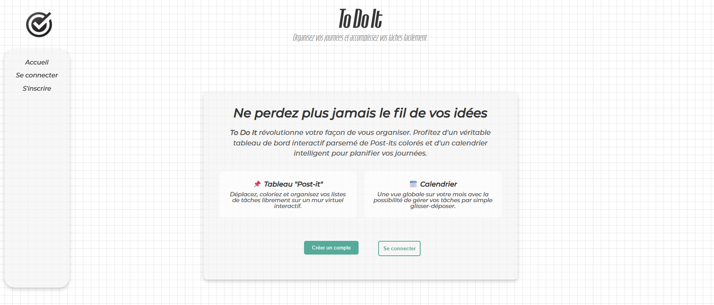
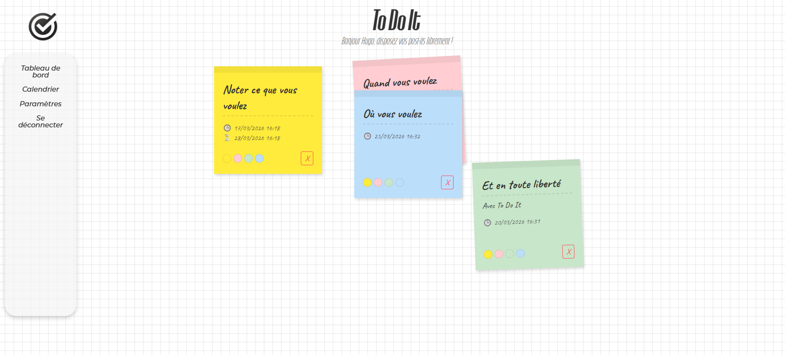
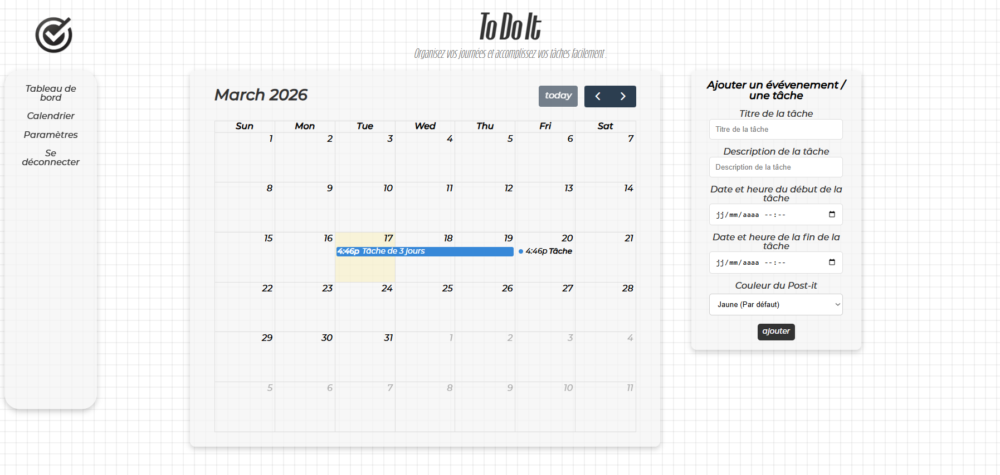

# To Do It

**To Do It** est une application web innovante et visuelle conçue pour vous aider à organiser vos journées et accomplir vos tâches avec style. Adieu les listes ennuyeuses, dites bonjour à un véritable mur de **Post-its colorés** !

## Captures d'écran du Projet

*(Pour que ces images s'affichent sur GitHub, placez vos captures d'écran réelles dans le dossier `assets/images/` en respectant les noms ci-dessous, ou mettez à jour les liens)*

### Page d'Accueil (Landing Page)

*La vitrine de présentation du projet.*

### Tableau de Bord "Post-its"

*Gérez vos tâches comme de vrais Post-its : déplacez-les librement (Drag & Drop) et personnalisez leurs couleurs.*

### Calendrier Interactif

*Une vue globale sur votre mois. Cliquez sur une tâche pour l'éditer via une modale ou déplacez-la.*

---

## Fonctionnalités Principales
- **Tableau de bord "Post-it"** : Un espace de travail interactif avec sauvegarde en temps réel de la position (X/Y) et de la couleur des notes via AJAX.
- **Calendrier unifié** : Édition complète des tâches grâce à une fenêtre modale et modification des dates par glisser-déposer (FullCalendar).
- **Paramètres utilisateur** : Interface de gestion de profil (Nom, Prénom, Email, Mot de passe).
- **Authentification robuste** : Sessions sécurisées et mots de passe hachés.
- **Sécurité** : Identifiants de base de données protégés via des variables d'environnement (`.env`).

## Technologies Utilisées
- **Frontend** : HTML5, CSS3, JavaScript Vanilla
- **Backend** : PHP 8+ (Architecture Orientée API)
- **Base de données** : PostgreSQL
- **Infrastructure** : Docker & Docker Compose

## Installation (via Docker)

Le projet est entièrement dockérisé pour simplifier son lancement.

### 1. Prérequis
- [Docker](https://www.docker.com/) installé et lancé (ex: Docker Desktop).

### 2. Configuration Initiale
Clonez le projet, puis créez votre fichier de configuration d'environnement :
```bash
# Copiez l'exemple pour initialiser votre configuration locale
cp .env.example .env
```
*(Si vous êtes sous Windows et n'avez pas bash, copiez/collez manuellement le fichier `.env.example` et renommez-le en `.env`)*

### 3. Lancer l'environnement
Dans le dossier du projet, exécutez :
```bash
docker-compose up -d --build
```

### 4. Accès
- **Application Web** : Ouvrez [http://localhost:8081/public/](http://localhost:8081/public/)
- **pgAdmin (Gestion de la DB)** : Ouvrez [http://localhost:5050/](http://localhost:5050/)

*(La base de données et les tables PostgreSQL se construisent automatiquement au premier démarrage grâce au script `init.sql`)*

## Fermer l'environnement
```bash
docker-compose down
```
